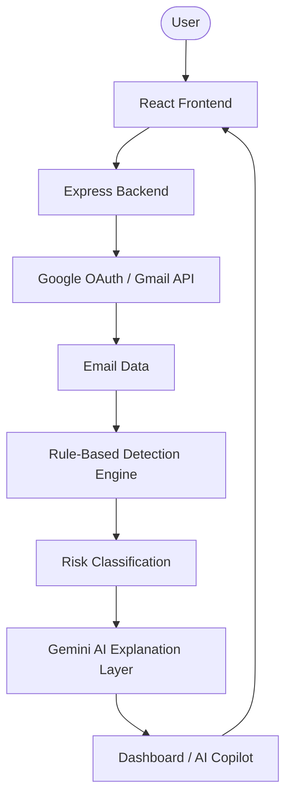

# PhishGuard AI — AI-Assisted Email Phishing Detection and Security Analysis Platform

## 1. Project Overview
PhishGuard AI is an MCA Cybersecurity academic project designed to demonstrate practical email phishing detection. It is a **local-first** application designed for learning, demonstration, research, and academic evaluation. It is **not** a publicly hosted service; rather, it is designed to run securely on the user's own computer, putting the user in full control of their data and APIs.

## 2. Problem Statement
Phishing remains one of the most sophisticated and damaging cybersecurity threats, heavily relying on social engineering to bypass standard technical perimeter defenses. Identifying these threats manually is time-consuming and error-prone for the average user.

## 3. Objectives
The objective of this project is to build a cohesive platform that demonstrates how email metadata and content can be systematically analyzed using deterministic security heuristics alongside AI-assisted contextual reasoning.

## 4. Key Features
- **Google OAuth Login:** Secure, delegated login without handling user credentials.
- **Gmail API Integration:** Seamless email scanning and retrieval via official Google APIs.
- **Rule-Based Phishing Analysis:** Fast, deterministic heuristic engine parsing emails for known indicators of compromise (IoCs).
- **Risk Scoring:** Algorithmic calculation generating actionable threat levels.
- **Threat Classification:** Emails are definitively classified as Safe, Review, or High Risk.
- **AI-Assisted Email Explanation:** Contextual, natural-language threat analysis utilizing Google Gemini AI.
- **Security Recommendations:** Concrete next steps generated for compromised or suspicious emails.
- **Security Dashboard:** An interactive React interface for reviewing scan results and inbox metrics.
- **AI Copilot:** A context-aware chatbot for querying the results of your active scan session.
- **Local Execution:** A decoupled, privacy-first architecture running entirely on your local machine.

## 5. Technology Stack
**Frontend:**
- React (Vite)
- TailwindCSS
- React Router
- Recharts
- Lucide React

**Backend:**
- Node.js
- Express
- express-session

**Authentication & Email Integration:**
- Passport.js (passport-google-oauth20)
- Googleapis (Gmail API)

**AI:**
- @google/genai (Google Gemini API)

## 6. System Architecture



## 7. Detection Methodology
PhishGuard AI uses a layered approach to threat detection to balance speed, deterministic accuracy, and contextual understanding.

## 8. Rule-Based Risk Analysis
The initial analysis is performed by a deterministic heuristic engine that rapidly scans metadata, headers, and body content for suspicious links, spoofed domains, and urgent language. Triggered rules are aggregated to produce a final, quantifiable Risk Score.

## 9. Gemini AI Explanation Layer
For emails that meet the suspicion threshold, the Gemini API is queried. While the core detection logic relies on the Rule Engine, Gemini acts as an advanced advisory layer to provide a natural-language explanation of *why* the deterministic engine flagged the email.

## 10. AI Copilot
The AI Copilot uses the active scan context and predefined backend query handling to answer questions dynamically. Example queries include:
- *How many emails were scanned?*
- *How many phishing emails were detected?*
- *How many suspicious emails are there?*
- *What is my security score?*
- *Is my inbox safe?*
- *What is the highest risk email?*
- *Show high-risk emails*
- *Show suspicious emails*
- *Summarize my latest scan*
- *What should I do next?*

## 11. Gmail API Integration
Emails are retrieved automatically through the official Googleapis client, ensuring that messages are fetched securely using modern REST principles.

## 12. Google OAuth Authentication
Authentication is handled via Passport.js using Google OAuth 2.0. This ensures that the application operates entirely via delegated tokens and never requests or stores a user's password.

## 13. Security Considerations
- API keys remain strictly server-side.
- Gmail access uses delegated OAuth tokens without requiring user passwords.
- Credentials must be stored in `.env`.
- `.env` must never be committed.
- Users should only analyze Gmail accounts they are explicitly authorized to access.
- This project is solely for educational/research purposes.

## 14. Project Structure
```text
phishguard-ai/
├── backend/
│   ├── config/
│   ├── controllers/
│   ├── middleware/
│   ├── routes/
│   ├── services/
│   ├── .env.example
│   ├── package.json
│   └── server.js
├── frontend/
│   ├── public/
│   ├── src/
│   │   ├── components/
│   │   ├── constants/
│   │   ├── context/
│   │   ├── pages/
│   │   └── main.jsx
│   ├── package.json
│   └── vite.config.js
├── .gitignore
├── LICENSE
└── README.md
```

## 15. Local Installation
To install and run PhishGuard AI on Windows:

```bash
git clone <repository-url>
cd phishguard-ai
```

**Backend:**
```bash
cd backend
npm install
```

**Frontend:**
```bash
cd frontend
npm install
```

## 16. Environment Configuration
You must provide your OWN Google OAuth credentials and Gemini API key. 
In the `backend` directory, copy `.env.example` to create a new `.env` file, and configure the required values:

```env
PORT=5000
NODE_ENV=development

BACKEND_URL=http://localhost:5000
FRONTEND_URL=http://localhost:5173

GEMINI_API_KEY=your_gemini_api_key
GOOGLE_CLIENT_ID=your_google_client_id
GOOGLE_CLIENT_SECRET=your_google_client_secret
SESSION_SECRET=your_session_secret
```

*(Never commit your real `.env` file to version control!)*

## 17. Google OAuth Configuration
Ensure your Google Cloud OAuth Client is configured with:
- **Authorized JavaScript origin:** `http://localhost:5173`
- **Authorized redirect URI:** `http://localhost:5000/api/auth/callback`

## 18. Running the Application
**Terminal 1:**
```bash
cd backend
node server.js
```

**Terminal 2:**
```bash
cd frontend
npm run dev
```

Then open your browser to: `http://localhost:5173`

## 19. Stopping the Application
To stop both development servers, press `Ctrl + C` in both Terminal 1 and Terminal 2.

## 20. Example Workflow
1. User starts both local servers and visits the frontend.
2. User authenticates via the "Continue with Google" button.
3. Upon callback, the user is redirected to the dashboard.
4. The dashboard triggers an email scan.
5. The local engine calculates risk scores while Gemini generates explanations.
6. The user interacts with the Copilot to summarize the threat landscape.

## 21. Limitations
- Rule-based detection can produce false positives and false negatives.
- AI-generated explanations should be treated as assistance, not absolute truth.
- The system does not guarantee detection of every phishing email.
- Gmail access requires appropriate OAuth permissions.
- This is **not** a replacement for enterprise email security systems.

## 22. Academic Use / Disclaimer
This software is provided for educational and research purposes only. The author is not responsible for any misuse, data loss, or security incidents arising from the deployment of this tool. Users must strictly adhere to the terms of service of all integrated APIs and respect privacy laws.

## 23. Future Enhancements
- ML-based phishing classification
- URL reputation analysis
- Attachment analysis
- Email-header analysis
- Threat intelligence integration
- MITRE ATT&CK mapping
- SIEM integration
- Advanced threat hunting
- Improved AI-assisted analysis

## 24. License
[MIT License](./LICENSE)
