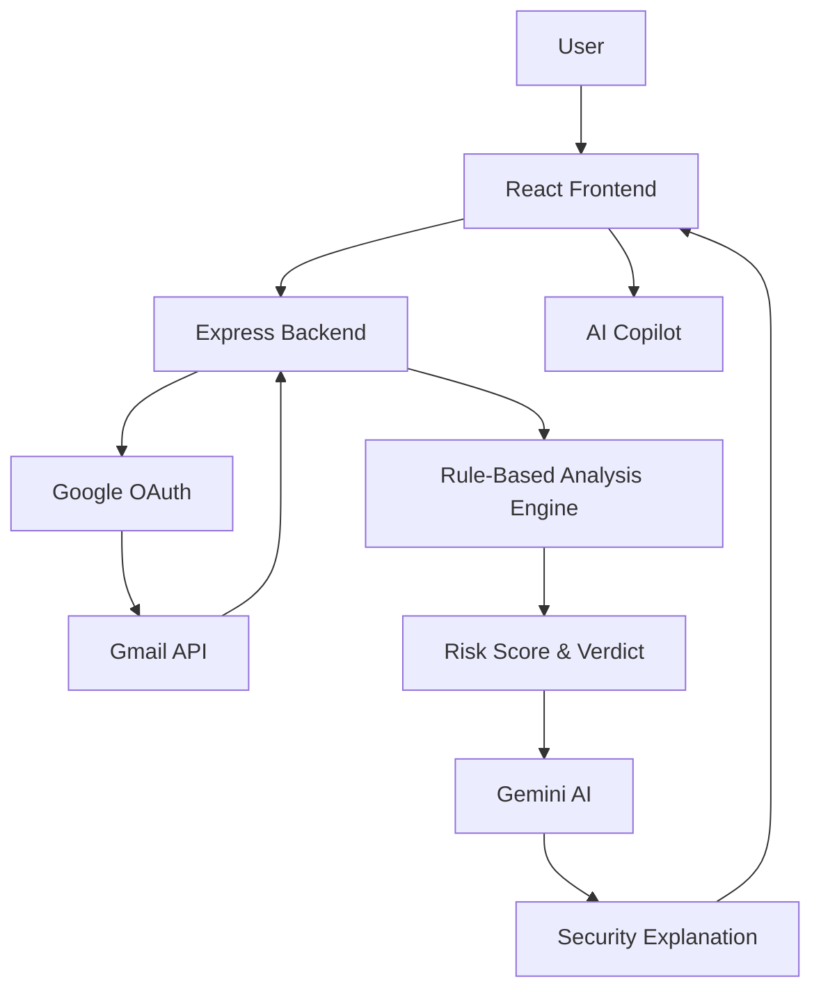

# 🛡️ PhishGuard AI

### AI-Assisted Email Phishing Detection & Security Analysis Platform

PhishGuard AI is a locally hosted cybersecurity project designed to demonstrate practical email phishing detection using Gmail integration, rule-based risk analysis, risk scoring, and Gemini AI-assisted security explanations.

*This project is intended for local development and academic demonstration. No public deployment is required.*

---

## 1. Overview
Phishing attacks continually exploit human trust, subverting perimeter defenses. PhishGuard AI combines the deterministic capabilities of rule-based analysis with the contextual understanding of Large Language Models to help users identify potentially suspicious messages in their inboxes. It provides an intuitive dashboard for analyzing threats and interacting with an AI Copilot.

## 2. Project Objective
Email phishing remains a major security threat. The project demonstrates how email metadata and content can be analyzed using security heuristics and AI-assisted reasoning to help users identify potentially suspicious messages.

## 3. Key Features
- Google OAuth login
- Gmail API integration
- Email scanning
- Rule-based phishing analysis
- Risk scoring
- Threat classification
- AI-assisted email explanation
- Security recommendations
- Security dashboard
- AI Copilot
- Local execution

## 4. How It Works
1. User authenticates using Google.
2. Application requests authorized Gmail access.
3. Emails are retrieved through Gmail API.
4. The backend analyzes the email.
5. The rule engine calculates risk indicators.
6. A verdict and risk score are generated.
7. Gemini AI provides an additional explanation.
8. Results are presented in the dashboard.
9. AI Copilot can answer questions using the scan context.

## 5. System Architecture



## 6. AI-Assisted Analysis
While the deterministic Rule Engine parses headers, domains, and links for strict indicators of compromise, the Gemini AI provides a deeper contextual explanation of the email's intent and urgency, acting as an advanced advisory layer.

## 7. AI Copilot
The AI Copilot uses the active scan context and predefined backend query handling to answer questions dynamically. Example queries include:
- How many emails were scanned?
- How many phishing emails were detected?
- How many suspicious emails are there?
- What is my security score?
- Is my inbox safe?
- What is the highest risk email?
- Show high-risk emails
- Show suspicious emails
- Summarize my latest scan
- What should I do next?

## 8. Technology Stack
**Frontend:**
- React (Vite)
- TailwindCSS
- React Router
- Recharts
- Lucide React

**Backend:**
- Node.js
- Express
- express-session

**Authentication & Email Integration:**
- Passport.js (passport-google-oauth20)
- Googleapis (Gmail API)

**AI:**
- @google/genai (Google Gemini API)

**Security/Analysis:**
- Custom Rule-Based Engine
- Helmet
- DOMPurify

## 9. Project Structure
```text
phishguard-ai/
├── backend/
│   ├── config/
│   ├── controllers/
│   ├── middleware/
│   ├── routes/
│   ├── services/
│   └── server.js
├── frontend/
│   ├── public/
│   └── src/
│       ├── components/
│       ├── pages/
│       └── main.jsx
├── .gitignore
├── LICENSE
└── README.md
```

## 10. Prerequisites
- Node.js (v18+)
- npm
- Google Cloud account/project
- Gmail API enabled
- Google OAuth credentials
- Gemini API key

## 11. Local Installation
This project is strictly for local execution.

**Backend:**
```bash
cd backend
npm install
```

**Frontend:**
```bash
cd frontend
npm install
```

## 12. Environment Configuration
Create a `.env` file in the `backend/` directory:

```env
PORT=5000
NODE_ENV=development

BACKEND_URL=http://localhost:5000
FRONTEND_URL=http://localhost:5173

GOOGLE_CLIENT_ID=your_google_client_id
GOOGLE_CLIENT_SECRET=your_google_client_secret
SESSION_SECRET=your_session_secret

GEMINI_API_KEY=your_gemini_api_key
```

*Never commit `.env` files to Git!*

## 13. Google OAuth Setup
Ensure your Google Cloud OAuth Client is configured with:
- **Authorized JavaScript origin:** `http://localhost:5173`
- **Authorized redirect URI:** `http://localhost:5000/api/auth/callback`

## 14. Gmail API Setup
Enable the **Gmail API** in your Google Cloud Console for the project housing your OAuth credentials.

## 15. Gemini API Setup
Generate a Gemini API key from Google AI Studio and place it in your `backend/.env` file.

## 16. Running the Application
**Terminal 1:**
```bash
cd backend
node server.js
```

**Terminal 2:**
```bash
cd frontend
npm run dev
```

Then open `http://localhost:5173` in your browser.

**This project is intended for local development and academic demonstration. No public deployment is required.**

## 17. Security & Privacy
- API keys remain strictly server-side.
- Gmail access uses delegated OAuth tokens without requiring user passwords.
- Credentials must be stored in `.env`.
- `.env` must never be committed.
- Users should only analyze Gmail accounts they are explicitly authorized to access.
- This project is solely for educational/research purposes.

## 18. Limitations
- Rule-based detection can produce false positives and false negatives.
- AI-generated explanations should be treated as assistance.
- The system does not guarantee detection of every phishing email.
- Gmail access requires appropriate OAuth permissions.
- This is not a replacement for enterprise email security systems.

## 19. Future Enhancements
- ML-based phishing classification
- URL reputation analysis
- Attachment analysis
- Email-header analysis
- Threat intelligence integration
- MITRE ATT&CK mapping
- SIEM integration
- Advanced threat hunting
- Improved AI-assisted analysis

## 20. Academic Value
This repository is presented as an MCA Cybersecurity academic project. It encapsulates theoretical security models in a functional, decoupled micro-architecture.

## 21. Screenshots
*(Future addition: Include UI captures of the dashboard here)*

## 22. Author
**Uzair Shaikh**  
MCA — Cybersecurity  
B.Tech — Automobile Engineering

## 23. Disclaimer
This software is provided for educational and research purposes only. The author is not responsible for any misuse, data loss, or security incidents arising from the deployment of this tool. Users must strictly adhere to the terms of service of all integrated APIs and respect privacy laws.
