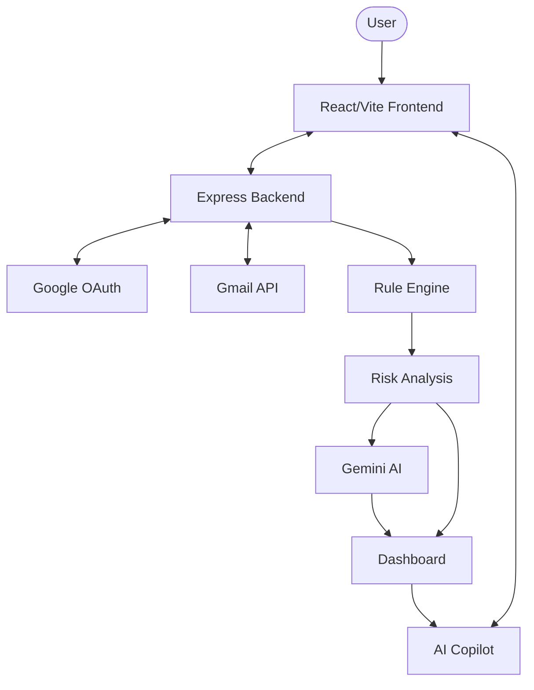

# 🛡️ PhishGuard AI

### AI-Assisted Email Phishing Detection & Security Analysis Platform

PhishGuard AI is a local-first cybersecurity application that analyzes Gmail messages using rule-based threat detection, risk scoring, authentication indicators, and Gemini AI-assisted explanations.

> 🎓 **MCA Cybersecurity Academic Project**  
> 🔒 **Local-first application** — runs on the user's own computer  
> 🚫 **Not a publicly hosted email security service**


---

## 2. PROJECT OVERVIEW

Phishing emails remain one of the most common and devastating attack vectors. Traditional users often struggle to distinguish legitimate messages from highly sophisticated, socially engineered suspicious emails.

PhishGuard AI demonstrates a comprehensive approach to mitigating this threat by integrating:
- **Gmail integration** via official REST APIs.
- **Automated email analysis** parsing metadata and content.
- **Rule-based phishing detection** executing strict deterministic security heuristics.
- **Risk scoring** assigning a quantifiable threat level.
- **Authentication/security indicators** validating sender identity.
- **AI-assisted explanation** translating complex threat vectors into human-readable analysis.
- **Interactive dashboard** for visualizing the inbox threat landscape.
- **AI Copilot** for querying real-time scan results interactively.

---

## 3. KEY FEATURES

| Feature | Description |
|---|---|
| 🔐 Google OAuth | Secure authentication through Google OAuth without handling passwords |
| 📧 Gmail Integration | Retrieves email data directly through the official Gmail API |
| 🧠 Rule-Based Detection | Evaluates suspicious email indicators (links, urgency, sender mismatches) |
| ⚠️ Risk Scoring | Assigns a mathematical threat/risk score based on triggered rules |
| 🤖 Gemini AI Analysis | Generates human-readable security explanations for flagged emails |
| 📊 Security Dashboard | Displays scan results, verdicts, and aggregated security metrics |
| 💬 AI Copilot | Answers questions using the active scan context |
| 🔎 Email Analysis | Provides detailed analysis of individual suspicious emails |

---

## 4. HOW PHISHGUARD AI WORKS

The processing pipeline guarantees that analysis is performed locally and contextualized securely:

1. **User** initiates login on the local port.
2. **React Frontend** redirects to the Google OAuth flow.
3. **Google OAuth** grants a delegated access token.
4. **Gmail API** uses the token to fetch recent emails.
5. **Email Retrieval** normalizes the raw MIME data.
6. **Rule-Based Analysis** executes the deterministic heuristic engine.
7. **Risk Score + Verdict** are calculated based on the triggered rules.
8. **Gemini AI Explanation** is requested *only* for flagged/suspicious emails to provide context.
9. **Dashboard + AI Copilot** display the final aggregated data back to the user.

*Note: The deterministic rule engine performs the initial security analysis. Gemini AI is utilized exclusively as an explanation and advisory layer, not as the primary binary phishing detector.*

---

## 5. ARCHITECTURE



**Architecture Flow:** The user interfaces solely with the React/Vite Frontend, which communicates with the local Express Backend. The backend handles all external API calls (OAuth, Gmail, Gemini) keeping API keys and access tokens strictly server-side. The local Rule Engine performs the threat analysis, and the results are returned to the frontend's Dashboard and AI Copilot.

---

## 6. DETECTION MODEL

PhishGuard AI uses a deterministic rule-based analysis layer that evaluates incoming emails against known phishing indicators. The engine checks for:

- **Suspicious language:** Scanning for common social engineering keywords (e.g., "password reset", "account suspended").
- **Urgency indicators:** Detecting artificial time constraints meant to force user action (e.g., "immediate action required", "within 24 hours").
- **Suspicious sender indicators:** Flagging mismatches between the `From` header and the actual `Reply-To` or `Return-Path` domains.
- **Link-related indicators:** Identifying mismatched anchor text, excessive external links, or known suspicious TLDs.

---

## 7. RISK CLASSIFICATION

Based on the cumulative weight of the rules triggered in the Detection Model, every email receives a risk score. This score is then mapped to a definitive verdict category:

- **SAFE:** The email exhibits no suspicious indicators.
- **REVIEW:** The email triggered minor warnings (e.g., unusual urgency) and warrants user caution.
- **HIGH_RISK:** The email triggered critical indicators (e.g., spoofed domains, suspicious links) and is highly likely to be a phishing attempt.

*The risk score helps prioritize investigation. It is a heuristic metric, not a guaranteed probability of compromise.*

---

## 8. AI COPILOT

The AI Copilot is an interactive security assistant that provides contextual responses using the current scan results. It is bound to the active scan context and acts as a dynamic interface to your inbox security report.

Example queries include:
- *How many emails were scanned?*
- *How many phishing emails were detected?*
- *How many suspicious emails are there?*
- *What is my security score?*
- *Is my inbox safe?*
- *What should I do next?*
- *What is the highest risk email?*
- *Show high-risk emails*
- *Show suspicious emails*
- *Summarize my latest scan*

*(The Copilot is an interface for querying existing scan data; it is not an autonomous security agent.)*

---

## 9. TECHNOLOGY STACK

| Layer | Technologies |
|---|---|
| **Frontend** | React, Vite, Tailwind CSS, JavaScript |
| **Backend** | Node.js, Express |
| **Authentication** | Passport.js, Google OAuth 2.0 |
| **Email Integration** | Googleapis (Gmail API) |
| **AI** | @google/genai (Gemini API) |
| **Security** | Session-based authentication, Environment-based secrets, Rule-based threat analysis, Helmet |

---

## 10. PROJECT STRUCTURE

```text
phishguard-ai/
├── backend/
│   ├── config/
│   ├── controllers/
│   ├── middleware/
│   ├── routes/
│   ├── services/
│   ├── .env.example
│   ├── package.json
│   └── server.js
│
├── frontend/
│   ├── public/
│   ├── src/
│   │   ├── components/
│   │   ├── constants/
│   │   ├── context/
│   │   ├── pages/
│   │   └── main.jsx
│   ├── index.html
│   ├── package.json
│   └── vite.config.js
│
├── .gitignore
├── LICENSE
└── README.md
```

---

## 11. LOCAL INSTALLATION

PhishGuard AI is built to run entirely locally. Follow these steps to set up your own instance.

### Prerequisites:
- Node.js (v18+)
- npm
- Google account
- Google Cloud project (with Gmail API enabled)
- Gemini API key

### Setup Steps:
1. **Clone repository:**
   ```bash
   git clone <repository-url>
   cd phishguard-ai
   ```
2. **Install backend dependencies:**
   ```bash
   cd backend
   npm install
   ```
3. **Install frontend dependencies:**
   ```bash
   cd ../frontend
   npm install
   ```
4. **Create environment file:**
   Copy `backend/.env.example` to `backend/.env`.
5. **Configure credentials:**
   Fill in your Gemini API key and Session Secret in the `.env` file.
6. **Configure Google OAuth:**
   Add your Google OAuth Client ID and Secret to the `.env` file. (Ensure your Google Cloud Console redirect URI is set to `http://localhost:5000/api/auth/callback`).
7. **Start backend:** (from `backend/` directory)
   `node server.js`
8. **Start frontend:** (from `frontend/` directory)
   `npm run dev`
9. **Open localhost:**
   Navigate to `http://localhost:5173` in your browser.

*(Note: `localhost` addresses refer exclusively to your own computer and are not public internet endpoints.)*

---

## 12. ENVIRONMENT CONFIGURATION

Your `backend/.env` file should look like this:

```env
PORT=5000
NODE_ENV=development
BACKEND_URL=http://localhost:5000
FRONTEND_URL=http://localhost:5173

GEMINI_API_KEY=your_gemini_api_key

GOOGLE_CLIENT_ID=your_google_client_id
GOOGLE_CLIENT_SECRET=your_google_client_secret

SESSION_SECRET=your_session_secret
```

> ⚠️ **WARNING:** Never commit real `.env` files, API keys, OAuth secrets, session secrets, access tokens, or refresh tokens to GitHub.

---

## 13. GOOGLE OAUTH CONFIGURATION

To allow local login, configure your OAuth 2.0 Client ID in your Google Cloud Console with the following settings:

- **Authorized JavaScript origin:**
  `http://localhost:5173`
- **Authorized redirect URI:**
  `http://localhost:5000/api/auth/callback`

*You must configure and use your own Google Cloud OAuth credentials.*

---

## 14. GEMINI API CONFIGURATION

The Gemini API is used as an AI-assisted explanation layer. 
- The Gemini API key belongs strictly in `backend/.env`.
- It must **never** be placed in the frontend configuration.
- It must **never** be committed to GitHub.
- The backend accesses it securely through environment variables to prevent client-side exposure.

---

## 15. RUNNING THE PROJECT

**Terminal 1 (Backend):**
```bash
cd backend
npm install
node server.js
```

**Terminal 2 (Frontend):**
```bash
cd frontend
npm install
npm run dev
```

Then open your browser and navigate to: `http://localhost:5173`

---

## 16. SECURITY DESIGN

PhishGuard AI implements several foundational security best practices:
- **Environment-based secrets:** All sensitive API keys and Client Secrets are isolated in `.env` files.
- **Google OAuth:** Authentication is delegated to Google; the application never handles or stores user passwords.
- **Session authentication:** Express-session manages secure user sessions locally.
- **Helmet:** The backend utilizes the Helmet middleware to set secure HTTP headers.
- **Backend-only Gemini API access:** The frontend never communicates directly with the Gemini API, preventing key leakage.
- **.gitignore protection:** Version control is explicitly configured to ignore all `.env` files and session stores.

---

## 17. SECURITY LIMITATIONS

PhishGuard AI is an academic cybersecurity project and should not be treated as a replacement for enterprise email security gateways, commercial EDR/XDR platforms, or professional SOC tooling.

- Rule-based detection can produce false positives/negatives.
- AI-generated explanations should be treated as assistance, not absolute truth.
- Users should independently verify suspicious emails.
- The application is intended strictly for educational and demonstration purposes.

---

## 18. SCREENSHOTS / DEMO

## 📸 Application Preview

> **TODO:** Add application screenshots here once local setup is complete.
> - Login Screen
> - Security Dashboard
> - Detailed Email Analysis
> - AI Copilot Interaction

---

## 19. EXAMPLE AI COPILOT SESSION

**User:**
*"How many emails were scanned?"*

**PhishGuard AI:**
*"Your latest scan analyzed 15 emails."*

*(Responses are generated dynamically from your active scan context based on the specific number of emails your Gmail inbox returned during the current session).*

---

## 20. USE CASES

- Cybersecurity education
- Phishing awareness demonstrations
- Email security research
- Rule-based threat detection experiments
- AI-assisted security analysis
- MCA academic project demonstrations
- Security dashboard prototyping

---

## 21. LEARNING OBJECTIVES

This project academically demonstrates:
- Secure API integration (REST)
- OAuth 2.0 authentication flows
- Email security analysis and metadata parsing
- Heuristic threat scoring models
- Decoupled Backend/Frontend architecture
- Generative AI integration for cybersecurity context
- Security-focused application development
- Secure environment configuration

---

## 22. FUTURE ENHANCEMENTS

*(FUTURE WORK)*
- More advanced phishing feature extraction
- URL reputation analysis (e.g., VirusTotal integration)
- Attachment analysis
- Email-header anomalies analysis (DKIM/SPF validation)
- Threat intelligence integration
- MITRE ATT&CK mapping
- SIEM integration
- Security event logging
- Automated test coverage
- Improved threat intelligence integration

---

## 23. DISCLAIMER

PhishGuard AI is an academic cybersecurity project developed for educational, research, and demonstration purposes. It is not intended to replace professional email security solutions.

---

## 24. LICENSE

[MIT License](./LICENSE)
